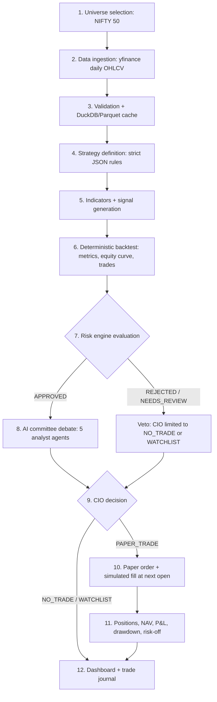

# QuantCouncil Architecture

QuantCouncil is a **personal AI quant research and PAPER trading lab** for learning, simulation,
backtesting, and AI-agent experimentation on Indian equities.

- **Scope v1:** NIFTY 50 universe, daily timeframe only, long-only strategies, paper trading only.
- **Philosophy:** *"AI can propose. Math can approve. Risk can veto."*

## What QuantCouncil Is

- A local-first research environment for defining rule-based strategies, backtesting them
  deterministically, evaluating them against a risk policy, and simulating trades on paper.
- A sandbox for multi-agent LLM experimentation, where AI agents debate and propose but are
  structurally prevented from producing or acting on invented numbers.
- An auditable pipeline: every simulated trade is traceable back to a backtest, a risk evaluation,
  and the agent decisions that led to it.

## What QuantCouncil Is Not

QuantCouncil never touches real money, real brokers, or real orders, and it is not a source of
financial advice. The complete enumeration of exclusions, including the permanently disallowed
execution actions, lives in [non-goals.md](non-goals.md).

## The Propose / Approve / Veto Hierarchy

Three layers with strictly increasing authority:

| Layer | Role | Authority |
|---|---|---|
| AI agents (LLMs) | Reason, summarize, debate, propose | **Propose only.** May never invent calculations or fake backtest results. |
| Quant engine (deterministic Python) | Indicators, signals, backtests, metrics | **Source of truth** for every number in the system. |
| Risk engine (deterministic Python) | Policy gates on backtest metrics and portfolio state | **Binding veto.** |

Hard rules (non-negotiable, enforced in code):

1. LLM agents may reason, summarize, debate, and propose, but must **never** invent calculations
   or fake backtest results. Any metric an agent cites must come verbatim from deterministic
   Python output.
2. Deterministic Python is the source of truth. If an agent statement and a computed metric
   disagree, the metric wins.
3. The risk engine has veto power: if `approved_by_risk=false`, the CIO agent decision **MUST**
   be `NO_TRADE` or `WATCHLIST` — never `PAPER_TRADE`. This constraint is enforced by a Pydantic
   validator in `packages/agents`, not merely by prompting. See [risk-policy.md](risk-policy.md).

## Monorepo Component Map

```
quantcouncil/
  apps/
    web/                    Next.js 15 + React 19 dashboard (port 3000)
    api/                    FastAPI service (port 8000), CORS for http://localhost:3000
  packages/
    quant_engine/           Indicators, signal generation, deterministic vectorized backtester
    risk_engine/            Risk policy config + deterministic evaluation; produces the veto
    agents/                 Six-agent AI committee (Phase 5); Pydantic-validated JSON outputs
    data_connectors/        yfinance ingestion + validation + cache for NIFTY 50 (Phase 2, done)
    mcp_server/             Optional MCP server (Phase 8); paper-trading + research tools only
  infra/                    Docker Compose (PostgreSQL 16); migrations/ placeholder until Phase 3 (Alembic deferred)
  data/                     Local artifacts: Parquet cache, DuckDB files, backtest outputs
  docs/                     This documentation set (the project constitution)
```

Each `packages/*` directory is an installable setuptools package; the root `requirements-dev.txt`
installs the API requirements plus all packages editable plus pytest and httpx. Root `pytest.ini`
sets `testpaths = apps/api packages`.

## The 12-Step Pipeline

From universe to dashboard, one full research cycle:

1. **Universe selection** — the NIFTY 50 constituent list is seeded into `assets`.
2. **Data ingestion** — `data_connectors` pulls daily OHLCV from yfinance (`.NS` suffix for NSE symbols).
3. **Data validation and caching** — duplicate, missing-value, and corporate-action sanity checks;
   validated bars land in `ohlcv_daily` and the local DuckDB + Parquet cache.
4. **Strategy definition** — a strategy is authored as strict JSON per
   [strategy-format.md](strategy-format.md) and stored in `strategy_definitions` (state `DRAFT`).
5. **Indicator and signal computation** — `quant_engine` computes indicators and evaluates the
   strategy's entry/exit rule trees into signals.
6. **Deterministic backtest** — the vectorized backtester produces the full metrics set, equity
   curve, and trade list; persisted to `backtest_runs` and `data/backtests/`.
7. **Risk evaluation** — `risk_engine` applies the policy in [risk-policy.md](risk-policy.md) to
   the backtest metrics and current portfolio constraints; verdict persisted to `risk_evaluations`.
8. **AI committee debate** — Technical Analyst, Quant Researcher, Bull, Bear, and Risk Narrator
   agents each review the deterministic artifacts and argue; every input and output is persisted
   to `agent_decisions`.
9. **CIO decision** — the CIO agent synthesizes the debate into `PAPER_TRADE`, `NO_TRADE`, or
   `WATCHLIST`, structurally bound by the risk veto.
10. **Paper order creation and simulated fill** — an approved decision creates a paper order,
    filled at the next trading day's open with zero slippage (v1 assumption); see
    [paper-trading-design.md](paper-trading-design.md).
11. **Portfolio tracking** — positions, cash, NAV, realized/unrealized P&L, drawdown, and
    risk-off mode are updated deterministically; journal entries are written to `trade_journal`.
12. **Dashboard reporting** — `apps/web` renders market data, backtest reports, the committee
    debate, risk status, the paper portfolio, and the journal. The UI displays numbers; it never
    computes financial metrics itself.



## Database Entities

Exactly ten tables (PostgreSQL 16, SQLAlchemy 2.x typed models):

| Table | Purpose |
|---|---|
| `assets` | Instrument master for the NIFTY 50 universe (NSE symbol, name, sector). |
| `ohlcv_daily` | Validated daily OHLCV bars per asset; the quant engine's only price input. |
| `strategy_definitions` | Strategy JSON rules plus lifecycle state (`DRAFT` ... `RETIRED`). |
| `backtest_runs` | Deterministic backtest results: full metrics set plus references to equity-curve and trade-list artifacts. |
| `risk_evaluations` | Risk engine verdicts in the strict JSON contract, stamped with `policy_version`. |
| `agent_decisions` | Every AI agent invocation: full inputs, full outputs, model metadata. |
| `paper_portfolios` | Paper portfolio state: cash, NAV, peak NAV, risk-off flag. |
| `paper_orders` | Simulated orders with lifecycle `PENDING -> FILLED / REJECTED / CANCELLED`. |
| `paper_positions` | Open and closed simulated positions with quantity, entry, stop-loss, P&L. |
| `trade_journal` | Append-only journal (`DECISION` / `FILL` / `NOTE` / `RISK_EVENT`) with mandatory audit references. |

**Where audit trails live:** `backtest_runs`, `risk_evaluations`, `agent_decisions`, and
`trade_journal` together form the audit trail. Every paper trade must be traceable via
`trade_journal` audit refs to its `backtest_runs` row, its `risk_evaluations` row, and the
`agent_decisions` rows that produced the CIO decision.

## Tech Stack

| Layer | Technology |
|---|---|
| Frontend | Next.js 15, React 19, TypeScript (App Router), port 3000 |
| API | FastAPI on Python 3.11, port 8000, CORS from `http://localhost:3000` |
| ORM | SQLAlchemy 2.x (typed `Mapped` / `mapped_column`) |
| Validation / config | Pydantic v2, pydantic-settings |
| Database | PostgreSQL 16 (psycopg2-binary driver), port 5432 |
| Local analytics cache | DuckDB + Parquet under `data/processed/ohlcv/` (Phase 2, done) |
| Market data | yfinance, free tier, `.NS` suffix for NSE (Phase 2) |
| LLM provider | Anthropic Claude API (Phase 5 onward; optional, never required for foundation) |
| Testing | pytest, httpx |
| Infrastructure | Docker Compose in `infra/` |

## Local-First Principle

QuantCouncil v1 runs entirely on the local machine:

- No paid services: market data via free yfinance; DuckDB and Parquet for local analytics.
- No hosted deployment requirement: `docker compose` for Postgres, local dev servers for web and API.
- The only external API is the optional Anthropic Claude API from Phase 5 onward
  (`ANTHROPIC_API_KEY` is optional and never required for the foundation).

Foundation-phase engineering decisions and their rationale are logged in
[assumptions.md](assumptions.md). The phased delivery plan is in
[development-roadmap.md](development-roadmap.md).
