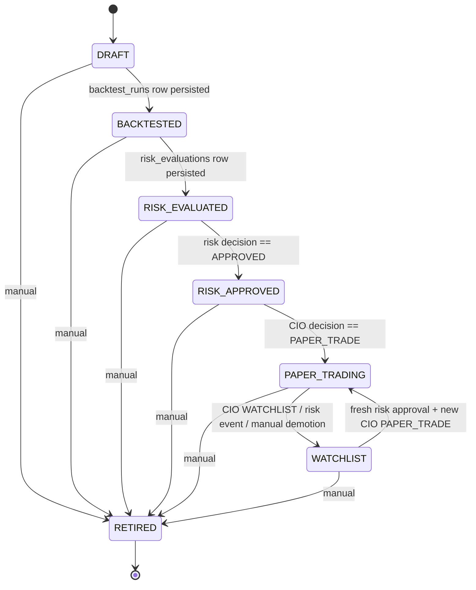

# QuantCouncil Strategy Rules Format v1

Machine-readable strategy definition format. A strategy definition is **strict JSON** stored in
`strategy_definitions` and interpreted by the rules interpreter in `packages/quant_engine`
(Phase 3 of the [development roadmap](development-roadmap.md)). The interpreter is
deterministic Python — the source of truth per [architecture.md](architecture.md). LLM agents
may propose definitions in this format but never evaluate them.

## Top-Level Fields

| Field | Type | v1 constraints |
|---|---|---|
| `name` | string | Unique, machine-friendly identifier. |
| `description` | string | Human-readable summary. |
| `universe` | list of strings | NSE symbols without suffix (the data connector appends `.NS`); subset of NIFTY 50. |
| `timeframe` | string | `"1d"` only in v1. |
| `direction` | string | `"long_only"` only in v1. |
| `entry` | condition tree | Boolean tree; when it evaluates true on a bar, enter (fill at next open). |
| `exit` | condition tree | Same structure; when true while in a position, exit. |
| `stop_loss` | object | `{"type": "percent", "value": 0.05}` in v1 (`value` in `(0, 1)`); `{"type": "atr", ...}` reserved for later and explicitly rejected by validation. Mandatory. |
| `position_sizing` | object | `{"type": "risk_percent", "value": 0.01}` in v1 (risk 1% of NAV per trade; `value` in `(0, 1)`). |
| `max_holding_days` | integer | **Optional** (Phase 3 addition). Integer >= 1. Time-based exit: once a position has been held this many bars (the entry fill bar counts as day 1), the backtester exits at the next bar's open with `exit_reason = "max_holding"`. |
| `costs` | object | **Optional** (Phase 3 addition). `{"transaction_cost_pct": ..., "slippage_pct": ...}` — each key independently optional, each a number in `[0, 1)`. Per-strategy overrides of the backtest configuration defaults (0.05% each); see [backtesting-engine.md](backtesting-engine.md). |

Validation (`quant_engine.strategy.validate_strategy`) is strict: unknown keys anywhere in the
definition are rejected, not ignored.

## Condition Trees

A condition tree is either a combinator or a single condition:

- `{"all": [ <tree>, ... ]}` — logical AND of the children.
- `{"any": [ <tree>, ... ]}` — logical OR of the children.
- Combinators may nest arbitrarily.

A **condition** compares a left-hand indicator series against either a scalar or another
indicator series:

```json
{
  "indicator": "<indicator name>",
  "params": { "window": 20 },
  "op": "<operator>",
  "value": 30
}
```

or

```json
{
  "indicator": "<indicator name>",
  "params": { "window": 20 },
  "op": "<operator>",
  "target": { "indicator": "<indicator name>", "params": { "window": 50 } }
}
```

Exactly one of `value` (scalar) or `target` (indicator reference) must be present.

**Target multiplier (v1 extension):** a `target` object may carry an optional numeric
`"multiplier"` (default `1.0`). The right-hand series is multiplied by it before comparison.
This expresses rules like "volume greater than 1.5x its 20-day average" without a separate
expression language.

### Operators (v1)

| Op | Semantics on bar t |
|---|---|
| `crosses_above` | left(t-1) <= right(t-1) AND left(t) > right(t) |
| `crosses_below` | left(t-1) >= right(t-1) AND left(t) < right(t) |
| `greater_than` | left(t) > right(t) |
| `less_than` | left(t) < right(t) |

### Indicators (v1)

| Indicator | Params | Definition |
|---|---|---|
| `sma` | `window` | Simple moving average of close. |
| `ema` | `window` | Exponential moving average of close. |
| `rsi` | `window` | Relative Strength Index of close. |
| `volume_sma` | `window` | Simple moving average of volume. |
| `close` | none | Daily close price series. |
| `volume` | none | Daily volume series. |
| `highest_close` | `window` | Highest close of the **prior** `window` bars, excluding the current bar (so `close greater_than highest_close(20)` means a 20-day closing-high breakout). |

`highest_close(window)` is an additional v1 indicator required by the volume-breakout strategy.

> **Implementation note (Phase 3):** the definition above — prior `window` bars, *excluding*
> the current bar — is implemented exactly as written. The raw indicator function
> `quant_engine.indicators.highest_close` remains a plain (inclusive) rolling max; the signals
> interpreter applies the one-bar exclusion via
> `indicators.highest_close(close, window).shift(1)`, so the `highest_close_<window>` audit
> column in a signal frame stores the shifted (exclusive) series and breakout conditions are
> satisfiable. See [backtesting-engine.md](backtesting-engine.md).

Signals computed on bar t lead to fills at bar t+1's open, per the fill model in
[paper-trading-design.md](paper-trading-design.md).

## The Three Initial Strategies

Universe lists below are shortened to five symbols for readability; production definitions
enumerate the full NIFTY 50 constituent list from `assets`.

### 1. SMA Crossover

```json
{
  "name": "sma_crossover_20_50",
  "description": "Enter long when SMA(20) crosses above SMA(50); exit when SMA(20) crosses below SMA(50). 5% stop-loss.",
  "universe": ["RELIANCE", "TCS", "HDFCBANK", "INFY", "ICICIBANK"],
  "timeframe": "1d",
  "direction": "long_only",
  "entry": {
    "all": [
      {
        "indicator": "sma",
        "params": { "window": 20 },
        "op": "crosses_above",
        "target": { "indicator": "sma", "params": { "window": 50 } }
      }
    ]
  },
  "exit": {
    "all": [
      {
        "indicator": "sma",
        "params": { "window": 20 },
        "op": "crosses_below",
        "target": { "indicator": "sma", "params": { "window": 50 } }
      }
    ]
  },
  "stop_loss": { "type": "percent", "value": 0.05 },
  "position_sizing": { "type": "risk_percent", "value": 0.01 }
}
```

### 2. RSI Mean Reversion

```json
{
  "name": "rsi_mean_reversion_14",
  "description": "Enter long when RSI(14) drops below 30 (oversold); exit when RSI(14) rises above 55. 5% stop-loss.",
  "universe": ["RELIANCE", "TCS", "HDFCBANK", "INFY", "ICICIBANK"],
  "timeframe": "1d",
  "direction": "long_only",
  "entry": {
    "all": [
      {
        "indicator": "rsi",
        "params": { "window": 14 },
        "op": "less_than",
        "value": 30
      }
    ]
  },
  "exit": {
    "all": [
      {
        "indicator": "rsi",
        "params": { "window": 14 },
        "op": "greater_than",
        "value": 55
      }
    ]
  },
  "stop_loss": { "type": "percent", "value": 0.05 },
  "position_sizing": { "type": "risk_percent", "value": 0.01 }
}
```

### 3. Volume Breakout Swing

```json
{
  "name": "volume_breakout_swing_20",
  "description": "Enter long on a 20-day closing-high breakout confirmed by volume above 1.5x its 20-day average; exit when close falls below SMA(20). 7% stop-loss.",
  "universe": ["RELIANCE", "TCS", "HDFCBANK", "INFY", "ICICIBANK"],
  "timeframe": "1d",
  "direction": "long_only",
  "entry": {
    "all": [
      {
        "indicator": "close",
        "params": {},
        "op": "greater_than",
        "target": { "indicator": "highest_close", "params": { "window": 20 } }
      },
      {
        "indicator": "volume",
        "params": {},
        "op": "greater_than",
        "target": { "indicator": "volume_sma", "params": { "window": 20 }, "multiplier": 1.5 }
      }
    ]
  },
  "exit": {
    "all": [
      {
        "indicator": "close",
        "params": {},
        "op": "less_than",
        "target": { "indicator": "sma", "params": { "window": 20 } }
      }
    ]
  },
  "stop_loss": { "type": "percent", "value": 0.07 },
  "position_sizing": { "type": "risk_percent", "value": 0.01 }
}
```

## Strategy Lifecycle State Machine

Exact state strings, stored on `strategy_definitions`:

```
DRAFT -> BACKTESTED -> RISK_EVALUATED -> RISK_APPROVED -> PAPER_TRADING -> WATCHLIST -> RETIRED
```



### Transition Requirements (Artifacts)

| Transition | Required artifact |
|---|---|
| `DRAFT -> BACKTESTED` | A completed `backtest_runs` row for this strategy (metrics + equity curve + trade list). |
| `BACKTESTED -> RISK_EVALUATED` | A `risk_evaluations` row for that backtest (any decision). |
| `RISK_EVALUATED -> RISK_APPROVED` | The `risk_evaluations` row has `decision == "APPROVED"` (`approved == true`); see [risk-policy.md](risk-policy.md). |
| `RISK_APPROVED -> PAPER_TRADING` | An approved risk evaluation **and** a persisted CIO `agent_decisions` row with `decision == "PAPER_TRADE"` (only possible when `approved_by_risk == true`). |
| `PAPER_TRADING -> WATCHLIST` | A CIO `WATCHLIST` decision, a `RISK_EVENT`, or a journaled manual demotion. |
| `WATCHLIST -> PAPER_TRADING` | A fresh approved risk evaluation and a new CIO `PAPER_TRADE` decision. |
| `* -> RETIRED` | Manual, journaled; terminal state. |

Editing a strategy's rules resets it to `DRAFT`: previous backtests and risk evaluations
describe the old rules and cannot carry the new rules through the lifecycle.
