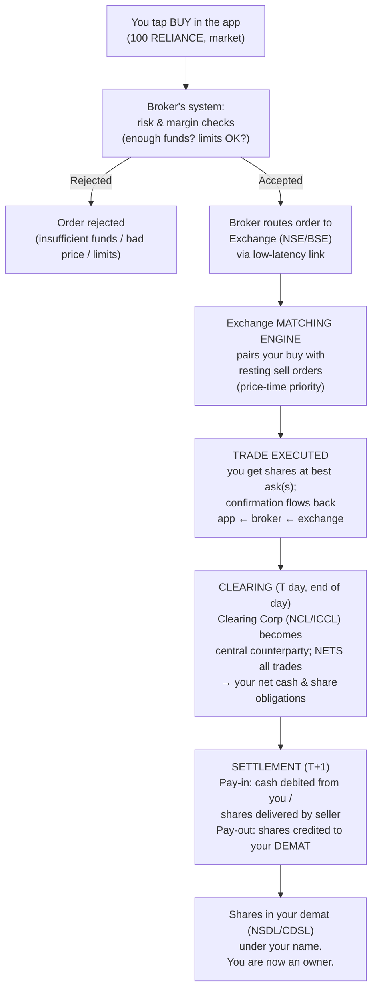

# 01 — How Markets Actually Work

> ⬅ Back to [README](../README.md) · Prev: [00 Foundations](../00-foundations/README.md) · Next: [02 Assets & Instruments](../02-assets-and-instruments/README.md)

> 💡 **Key takeaway:** When you "buy a stock," you don't buy it *from the company* or *from the
> exchange* — you buy it from another trader, matched anonymously by a computer, with several
> institutions guaranteeing and recording the transfer behind the scenes. Understanding this plumbing
> demystifies slippage, settlement, margin, and why your order sometimes doesn't fill.

**Contents**
1. [The institutions and who does what](#1-the-institutions-and-who-does-what)
2. [Primary vs secondary markets; IPOs](#2-primary-vs-secondary-markets-ipos)
3. [The order book, bid, ask, and spread](#3-the-order-book-bid-ask-and-spread)
4. [Market depth and liquidity](#4-market-depth-and-liquidity)
5. [Order types](#5-order-types)
6. [Partial fills and slippage](#6-partial-fills-and-slippage)
7. ["What happens after I press BUY?" — the full lifecycle](#7-what-happens-after-i-press-buy--the-full-lifecycle)
8. [Settlement (T+1 / T+0)](#8-settlement-t1--t0)
9. [Short selling, borrowing, and margin](#9-short-selling-borrowing-and-margin)
10. [Checklist & common mistakes](#10-checklist--common-mistakes)

---

## 1. The institutions and who does what

A modern market is a **stack of specialized institutions**, each with one job. Using India as the
concrete example:

| Institution | Job | Indian example |
|---|---|---|
| **Regulator** | Sets rules, licenses participants, polices fraud | **SEBI** (Securities and Exchange Board of India) |
| **Exchange** | Runs the venue and the **matching engine** that pairs buy/sell orders | **NSE**, **BSE** |
| **Broker** | Your licensed gateway to the exchange; routes your orders, holds your account | Zerodha, Groww, Angel One, ICICI Direct, … |
| **Clearing corporation** | Steps between buyer and seller as **central counterparty (CCP)**; nets obligations; guarantees the trade completes | **NSE Clearing (NCL)**, **Indian Clearing Corp (ICCL)** |
| **Depository** | Holds your shares electronically (in *demat* form); records ownership | **NSDL**, **CDSL** |
| **Depository Participant (DP)** | The depository's agent (usually your broker) that services your demat account | Your broker acting as DP |

Why so many layers? **To manage risk and record ownership reliably.** The exchange matches trades fast;
the clearing corp ensures that even if your counterparty defaults, *you still get your shares/cash*
(it guarantees settlement); the depository makes ownership a secure ledger entry rather than a paper
certificate that can be forged or lost. See the deep-dive in [Indian Markets](../17-indian-markets/README.md).

> 💡 **Key takeaway:** The **clearing corporation is the unsung hero** — by becoming the buyer to every
> seller and the seller to every buyer, it removes *counterparty risk*. You never worry that the
> anonymous person on the other side of your trade won't pay; the CCP stands in the middle.

---

## 2. Primary vs secondary markets; IPOs

- **Primary market:** where securities are *created and first sold*, and money actually reaches the
  **issuer** (the company or government). An **IPO** (Initial Public Offering) is the classic example:
  a company sells new shares to the public and receives the proceeds to fund its business.
- **Secondary market:** where *already-issued* securities trade **between investors**. The company
  gets *nothing* from these trades — money flows from buyer to seller. This is where ~all your daily
  trading happens (NSE/BSE order books).

| | Primary market | Secondary market |
|---|---|---|
| Who gets the money | The **issuer** (company/govt) | The **selling investor** |
| Example | IPO, FPO, new bond issue | Buying INFY shares on NSE today |
| Purpose | Raise capital | Liquidity & price discovery |
| Common mistake | Thinking buying shares "funds the company" | It doesn't — in the secondary market, you pay another investor |

> ⚠️ **Common mistake:** "I'm supporting company X by buying its stock." Unless it's a primary issue
> (IPO/FPO), your purchase money goes to *another shareholder*, not the company. (You do indirectly
> affect the company via its share price, cost of capital, and management incentives — but no cash
> changes hands with the firm.)

An **IPO** in India: the company files a prospectus (DRHP) with SEBI, sets a price band, and takes
bids during a window; funds are **blocked** in your bank via **ASBA/UPI** and only debited if shares
are *allotted*; listing follows a few days later. More in [Indian Markets → IPOs](../17-indian-markets/README.md).

---

## 3. The order book, bid, ask, and spread

Every liquid stock has an **order book** (a.k.a. limit order book) — a live, sorted list of all
resting **buy** orders (bids) and **sell** orders (asks/offers) at each price.

- **Bid** = the highest price a buyer is currently willing to **pay**.
- **Ask (offer)** = the lowest price a seller is currently willing to **accept**.
- **Spread** = Ask − Bid. The gap between what buyers offer and sellers demand.

Illustrative order book for a stock (last trade ₹500.00):

```text
        BUYERS (bids)                 SELLERS (asks)
   Qty     Price                 Price     Qty
   1,200   499.80   <- best bid  500.20    900    <- best ask   (spread = 0.40)
     800   499.75                500.25   1,500
   2,000   499.70                500.30    600
     500   499.60                500.40   3,000
```

- The **best bid** is ₹499.80; the **best ask** is ₹500.20; the **spread** is ₹0.40.
- A **market buy** would hit the best ask (₹500.20). A **market sell** would hit the best bid
  (₹499.80). Notice you *buy at the ask and sell at the bid* — you immediately "pay the spread."

> 💡 **Key takeaway:** The **spread is a real cost of trading** — a hidden fee you pay every round trip
> just by crossing it. Liquid stocks (RELIANCE) have spreads of a paisa or two; illiquid smallcaps can
> have spreads of 1–2%+, which quietly devours returns. See [microstructure](../15-market-microstructure/README.md).

---

## 4. Market depth and liquidity

**Market depth** = how much quantity is available at each price level in the book. It tells you how big
a trade the market can absorb *before the price moves*.

- A **deep** book (big quantities at many nearby prices) absorbs large orders with little price
  impact — high [liquidity](../00-foundations/README.md#9-liquidity).
- A **thin/shallow** book (small quantities, gaps between levels) means even a modest order "walks the
  book," filling at progressively worse prices — [slippage](#6-partial-fills-and-slippage).

**Example (using the book above):** You want to buy **2,500** shares *at market*. The best ask has only
900 at ₹500.20, then 1,500 at ₹500.25, then 600 at ₹500.30. Your order fills: 900 @ 500.20 + 1,500 @
500.25 + 100 @ 500.30. Average price ≈ **₹500.24**, *worse* than the ₹500.20 you saw — because you
consumed multiple levels. That difference is slippage caused by insufficient depth.

> ⚠️ **Common mistake:** Judging liquidity by the *last price* alone. The last trade might be ₹500,
> but if there's only 100 shares on offer there, your 5,000-share order will fill far higher. **Always
> check depth before trading size**, especially in smallcaps and far-OTM options.

---

## 5. Order types

Orders are the vocabulary you use to talk to the matching engine. The four core types:

| Order type | What it does | Guarantees | Does NOT guarantee | Use when |
|---|---|---|---|---|
| **Market** | Buy/sell immediately at best available price(s) | **Execution** (you'll get filled) | **Price** (can slip) | You need *in/out now* and it's liquid |
| **Limit** | Buy/sell only at your price *or better* | **Price** (won't fill worse) | **Execution** (may never fill) | You care about price, can wait |
| **Stop (stop-market)** | Becomes a *market* order when a trigger price is hit | Execution once triggered | Price (slips on gaps) | Exiting a loser / triggering entries |
| **Stop-limit** | Becomes a *limit* order when triggered | Price | Execution (may not fill in a fast move) | You want a stop *and* price control |

**Confusable pair — the classic table:**

| Concept | Meaning | Example | Common mistake |
|---|---|---|---|
| **Market order** | Fill now at whatever price is available | "Buy 100 at market" → fills at best ask(s) | Using it in illiquid names → nasty slippage |
| **Limit order** | Fill only at a set price or better | "Buy 100 @ ₹499" → waits until someone sells at ₹499 | Setting it too far → it never fills, you miss the move |

> 💡 **Key takeaway:** **Market = certainty of fill, uncertainty of price. Limit = certainty of price,
> uncertainty of fill.** Choosing between them is choosing which risk you'd rather bear. Stops inherit
> this same trade-off (see [Risk Management → stops](../07-risk-management/README.md#3-stop-losses-done-properly)).

---

## 6. Partial fills and slippage

- **Partial fill:** your order executes for *part* of its quantity because not enough was available at
  your terms. A limit order for 1,000 shares might fill 300 now and leave 700 resting until more
  counterparty interest appears (or it expires).
- **Slippage:** the difference between the price you *expected* and the price you *got*. Caused by (a)
  thin depth (walking the book), (b) fast-moving prices between click and execution, and (c) gaps
  (price jumps with no trading in between — e.g. overnight news). Slippage is usually *against* you.

**Slippage is a core, unavoidable cost** — especially for larger size, illiquid instruments, fast
markets, and market orders. Serious [backtests](../12-backtesting-and-statistics/README.md) *must*
model it, or they overstate returns badly.

> ⚠️ **Common mistake:** Backtesting a strategy as if every fill happened exactly at the printed price
> with unlimited size. Real fills slip, real books are finite, and a strategy that trades often can
> have its entire "edge" eaten by slippage + costs. See [Backtesting pitfalls](../12-backtesting-and-statistics/README.md#backtesting-pitfalls).

---

## 7. "What happens after I press BUY?" — the full lifecycle

Let's trace a single order end-to-end. Say you place a **market order to buy 100 shares of RELIANCE**
in your broker's app.



**Step by step, in words:**

1. **Your click → broker.** The app sends the order to your broker's servers. This takes milliseconds.
2. **Risk & margin checks (broker).** The broker instantly verifies you have the funds/margin, the
   order passes exchange price bands and position limits, and it's a valid instrument. If not →
   *rejected* (a common, harmless event). This is why you sometimes see "insufficient funds" or "price
   out of range."
3. **Broker → exchange.** The broker forwards the order to NSE/BSE over a fast dedicated connection.
   Your broker is a *member*; you access the exchange *through* them.
4. **Matching engine.** The exchange's central computer maintains the [order book](#3-the-order-book-bid-ask-and-spread)
   and matches orders by **price-time priority**: best price first, and among equal prices, whoever was
   there *earliest* gets filled first ([microstructure](../15-market-microstructure/README.md)). Your
   market buy is paired with the lowest-priced resting sell orders.
5. **Execution & confirmation.** A trade is struck. You now *own* the shares in a trade sense, and a
   confirmation races back: exchange → broker → your app ("order executed, 100 @ ₹1,400.xx"). All of
   the above typically happens in **well under a second**.
6. **Clearing (end of T day).** The **clearing corporation** collects every trade, becomes the
   counterparty to both sides, and performs **netting** — instead of settling thousands of individual
   trades, it computes each participant's *net* obligation (e.g., "broker X must deliver 12,000 shares
   net and receive ₹Y net"). This slashes the number of transfers and guarantees completion.
7. **Settlement (T+1 in India).** On the next business day, **pay-in** and **pay-out** occur: cash
   moves from buyers to sellers and shares move from sellers to buyers, via the depositories. Your
   **demat account (NSDL/CDSL)** is credited with the RELIANCE shares; the money leaves your account.
8. **You are an owner of record.** Only now is the change of ownership *final and irreversible*,
   recorded in the depository's ledger.

> 💡 **Key takeaway:** "Buying a stock" is really **three distinct events**: *matching* (instant,
> price is set), *clearing* (netting + guarantee, end of day), and *settlement* (actual transfer of
> cash and shares, T+1). Most surprises — margin blocks, delivery obligations, short-delivery
> auctions, why you can't immediately re-sell in some products — come from confusing these three.

🤔 **Think about this:** If the exchange matches your trade in under a second, why does *settlement*
take a whole day? (Because settlement moves *actual cash and securities* across banks and depositories
for millions of netted obligations safely. India has compressed this from T+3 → T+2 → T+1, and is
piloting T+0/instant — see below. Faster settlement reduces risk but requires huge operational
upgrades.)

---

## 8. Settlement (T+1 / T+0)

🗓️ *Current as of latest sources; verify against NSE/BSE/SEBI, as India is actively shortening this.*

- **"T"** = trade date. **T+1** = one *business* day later.
- **India is a global leader here.** The market moved T+2 → **T+1 in early 2023** (fully rolled out by
  end-January 2023) for all equities, ETFs, REITs, and InvITs. Under T+1, a trade today settles
  tomorrow — shares and cash finalize on T+1.
- **T+0 (same-day) settlement** launched as an *optional* beta on **28 March 2024** and has been
  expanded in phases to the **top 500 stocks** by market cap; it runs *alongside* T+1 (not replacing
  it). SEBI has also been piloting an even faster **instant settlement** mechanism.
- **Why it matters to you:** T+1 means funds/shares free up faster (better capital efficiency), but
  also that you must have **cash available sooner** — a failed pay-in (insufficient funds on
  settlement) triggers penalties and short-delivery handling.

> 💡 **Key takeaway:** Faster settlement = less counterparty risk and quicker access to your money,
> but *less float* — you can't rely on a multi-day gap to arrange funds. Know your product's cycle
> before you trade. Full detail and the current status in [Indian Markets](../17-indian-markets/README.md#settlement).

---

## 9. Short selling, borrowing, and margin

### Short selling — profiting from a *fall*
Normally you buy low then sell high. **Short selling reverses the order:** you *sell first* (shares you
don't own, borrowed) and *buy back later*, hoping to buy back cheaper and pocket the difference.

- Mechanically, you **borrow** the shares (via a stock-lending mechanism — in India, **SLBM**,
  Securities Lending and Borrowing) to deliver to the buyer, then buy them back later to return them.
- **The risk is asymmetric and dangerous:** a stock you *buy* can only fall to zero (−100% max), but a
  stock you *short* can rise without limit — your **potential loss is theoretically unbounded**, and a
  "short squeeze" (forced buying by shorts) can spike prices violently.

> 🚩 **Myth:** "Shorting is just buying in reverse, same risk." False — the loss profiles are opposite.
> A short's downside is unbounded and can be forcibly closed against you at the worst time. Treat
> shorting with far more caution than buying.

**Indian nuance:** retail short-selling of *cash equities* is generally restricted to **intraday**
(you must square off by day-end); true multi-day shorting is done via **futures and options**
([Futures](../09-futures/README.md)/[Options](../10-options/README.md)) or SLBM. See [Indian Markets](../17-indian-markets/README.md).

### Margin and leverage
**Margin** is collateral you post to take a position larger than your cash — i.e., to use **leverage**.

- **Example:** With 20% margin, ₹1,00,000 controls a ₹5,00,000 position (5× leverage). A 10% move
  makes/loses ₹50,000 — **50%** of your capital. Leverage multiplies *both* gains and losses.
- **Margin call:** if the position moves against you and your collateral falls below the required
  level, the broker demands more funds — or **force-liquidates** your position, often at the worst
  possible price. This is how leveraged traders get wiped out in a single bad session.

> 💡 **Key takeaway:** Leverage does not create edge; it *scales* whatever you already have — including
> a losing strategy and your emotions. The margin call is the mechanism that turns a temporary adverse
> move into a *permanent* loss. Handle with the respect described in
> [Risk Management → leverage](../07-risk-management/README.md#10-portfolio-level-risk-correlation-exposure-leverage).

---

## 10. Checklist & common mistakes

### ✅ Before placing any order
- [ ] I checked the **spread** and **depth** — is there enough size at prices I'll accept?
- [ ] I chose the right **order type** (market vs limit vs stop) for my priority (fill vs price).
- [ ] I know the product's **settlement/margin** rules (can I hold overnight? do I need delivery?).
- [ ] For shorts, I understand the **unbounded loss** and squeeze risk.
- [ ] For leverage, I've sized so a normal move can't trigger a **margin call**.

### ⚠️ Mistakes rooted in misunderstanding the plumbing
| Mistake | Root cause |
|---|---|
| Surprised by slippage on a market order | Ignored depth; only looked at last price |
| Limit order "didn't work" | It just never got filled — that's a *feature*, not a bug |
| Thought buying shares funds the company | Confused secondary with primary market |
| Blindsided by a margin call | Didn't respect how leverage + adverse moves interact |
| Held ITM stock options into expiry unexpectedly | Didn't know about physical settlement ([Options](../10-options/README.md#10-indian-market-specifics)) |
| Assumed the trade was "done" the instant it filled | Confused matching with settlement (T+1) |

---

### Related sections
- [15 Market Microstructure](../15-market-microstructure/README.md) — the order book and matching engine, up close.
- [17 Indian Markets](../17-indian-markets/README.md) — SEBI/NSE/BSE/NSDL/CDSL, settlement, and costs in detail.
- [03 Price & Market Behavior](../03-price-and-market-behavior/README.md) — how the book turns into price moves.
- [Glossary](../glossary/README.md) — order book, spread, slippage, clearing, settlement, margin.
- [20 Exercises → Beginner](../20-exercises/README.md#beginner) — read a book, compute a spread, size a fill.

> Next: [02 — Assets & Instruments](../02-assets-and-instruments/README.md) →
