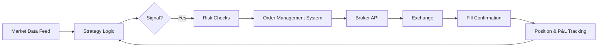

# 13 — Algorithmic Trading

> ⬅ Back to [README](../README.md) · Prev: [12 Backtesting & Statistics](../12-backtesting-and-statistics/README.md) · Next: [14 Quantitative Trading](../14-quantitative-trading/README.md)

> 💡 **Key takeaway:** "Algorithmic trading" just means a **computer executes rules instead of a human
> clicking buttons**. The strategy logic can be as simple as a moving-average crossover or as complex
> as a statistical-arbitrage model — the *automation* is what this section is about, not the *edge*
> (that's [14](../14-quantitative-trading/README.md)). Automation removes hesitation and fat-finger
> errors; it does **not** remove the need for a validated edge from [12](../12-backtesting-and-statistics/README.md).

**Learning objectives:** distinguish strategy logic from execution mechanics; understand order-execution
algorithms; know what infrastructure algo trading requires; understand India's regulatory framework for
retail algo trading.

*This section is a substantive outline. It can be expanded to flagship depth — e.g. full Python
execution-bot code, a broker-API walkthrough — on request.*

---

## 1. Why automate at all

| Reason | Detail |
|---|---|
| **Speed** | Reacts in milliseconds; a human can't watch 50 charts and click in time |
| **Discipline** | No hesitation, no revenge trading, no "just one more minute" — see [11](../11-trading-psychology/README.md) |
| **Scale** | Can monitor/trade hundreds of instruments simultaneously |
| **Consistency** | Executes the *backtested* rule exactly, every time (assuming the code is correct) |

> ⚠️ **Common mistake:** Believing automation itself is an edge. A bad strategy executed perfectly is
> still a bad strategy — it just loses money faster and with more conviction. Validate in
> [12](../12-backtesting-and-statistics/README.md) *before* automating.

---

## 2. Types of algorithmic systems

| Type | What it does | Example |
|---|---|---|
| **Signal generation only** | Computer flags a trade idea; human executes | Screener emails you when RSI < 30 |
| **Execution algorithms** | Human/system decides *what*, algo decides *how* to fill it with minimal impact | TWAP, VWAP, Iceberg orders |
| **Fully automated strategy** | Computer decides entry, size, exit, and sends the order — no human in the loop | A mean-reversion bot on NIFTY futures |
| **High-frequency trading (HFT)** | Automated + latency-sensitive (micro/milliseconds), usually market-making or arbitrage | See [15 Microstructure](../15-market-microstructure/README.md) |

---

## 3. Execution algorithms (the "how", not the "what")

Even a fully discretionary trader can benefit from execution algos when order size is large relative to
liquidity — see [Market depth](../01-how-markets-work/README.md#4-market-depth-and-liquidity) and
[Slippage](../01-how-markets-work/README.md#6-partial-fills-and-slippage).

- **TWAP (Time-Weighted Average Price):** splits a large order into equal slices over a time window.
- **VWAP (Volume-Weighted Average Price):** slices sized to match historical volume curve — more in
  liquid periods, less in thin ones. See [VWAP in Technical Analysis](../05-technical-analysis/README.md#vwap).
- **Iceberg / hidden orders:** shows only a small visible portion of a large order to avoid signaling.
- **POV (Percentage of Volume):** paces execution as a fixed % of real-time market volume.

> 🤔 **Think about this:** Execution algorithms exist because *the act of trading changes the price*
> (market impact — see [15](../15-market-microstructure/README.md)). A retail trader with a ₹50,000
> order rarely needs this; a fund moving ₹50 crore does.

---

## 4. Building blocks of a retail algo system

| Component | Role | Failure mode if missing |
|---|---|---|
| **Data feed** | Live prices, depth | Stale data → wrong decisions |
| **Strategy logic** | The validated rule from [12](../12-backtesting-and-statistics/README.md) | Untested logic → live losses |
| **Risk checks** | Hard limits: max position, max loss/day, circuit breakers | One bug wipes the account |
| **Order Management System (OMS)** | Tracks working orders, avoids duplicates | Double-fills, orphan orders |
| **Broker API** | Sends/receives orders (REST/WebSocket) | Rate limits, auth expiry |
| **Logging/monitoring** | Alerts on anomalies | Silent failures overnight |

> 🚩 **Red flag:** A live algo with no kill switch, no max-loss circuit breaker, and no logging is not
> a trading system — it's an accident waiting for a data glitch.

---

## 5. India's regulatory framework for retail algo trading 🗓️

SEBI has been rolling out a formal framework (2025–2026) for retail participation in algorithmic
trading, requiring exchange-approved/tagged algorithms, broker-level API rate and risk controls, and
traceability of orders back to a registered algo. Rules are actively evolving — **verify current
requirements on the [NSE](https://www.nseindia.com) and [SEBI](https://www.sebi.gov.in) sites** before
deploying anything live. See [Resources](../resources/README.md).

---

## 6. Practical realities

- **Latency ≠ retail concern (usually).** Retail algos competing on strategy quality, not microseconds,
  don't need co-location. HFT-style latency arbitrage is a different, capital- and infrastructure-intensive
  game — see [15](../15-market-microstructure/README.md).
- **APIs fail.** Networks drop, brokers rate-limit, exchanges have outages. Design for graceful failure
  (e.g., "if I can't confirm my position, flatten and stop" beats "assume last known state is still true").
- **Paper trade the *automation*, not just the strategy.** A profitable strategy can still lose money to
  a bug in the order-sending code. Test the whole pipeline, not just the backtest.

---

✅ **Ready to move on when:** you can explain the difference between strategy logic and execution
mechanics, describe what a risk-check layer must guard against, and state (accurately, checking current
sources) what India's retail algo framework currently requires.

**Related sections:** [12 Backtesting](../12-backtesting-and-statistics/README.md) ·
[14 Quantitative Trading](../14-quantitative-trading/README.md) ·
[15 Market Microstructure](../15-market-microstructure/README.md) ·
[17 Indian Markets](../17-indian-markets/README.md)

**Next →** [14 Quantitative Trading](../14-quantitative-trading/README.md)
